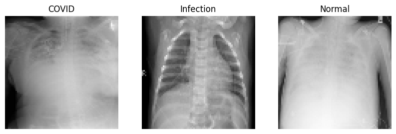
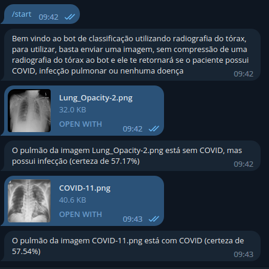

# CNN-COVID
Rede Neural Convolucional pequena, integrada com um bot do Telegram para classificação de imagens de radiografias de pulmão. Utilizado como projeto de TCC no curso de Engenharia de computação. Obtém-se uma acurácia de aproximadamente 85%.

A base de dados utilizada foi retirada do Kaggle e está presente no link:
https://www.kaggle.com/datasets/tawsifurrahman/covid19-radiography-database?page=2

As imagens dessa base de dados foram separadas em três diretórios, um para imagens de COVID, um para imagens de infecção sem COVID e um para pulmões saudáveis, todos com o mesmo número de imagens.

O arquivo ‘redecorona.py’ treina a rede e salva o modelo e ‘botcorona.py’ utiliza esse modelo para executar o bot.

Além dos arquivos aqui presentes, é necessário criar um arquivo ‘paths.py’ com as variáveis ‘bot_hash’ (contendo o token de acesso, criado pelo BotFather do Telegram), ‘model_path’ (caminho do diretório onde será salvo o modelo da rede neural), ‘dump’ (caminho do diretório para armazenar fotos temporárias) , ’data_path’ (caminho do diretório para a base de dados).

Com a execução do botcorona espera-se o comportamento exemplificado abaixo.

